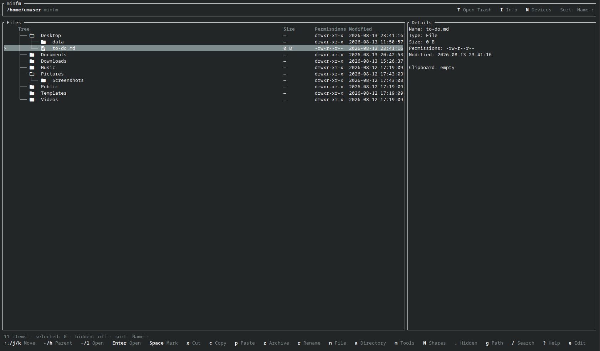

# minfm

<p>
  <a href="https://github.com/shukzi/minfm/actions/workflows/ci.yml"></a>
  <a href="https://github.com/shukzi/minfm/releases/latest"></a>
  <a href="LICENSE"></a>
</p>

minfm is a minimal terminal file manager for Linux, written in Rust. It provides
intuitive keyboard navigation and integrated disk management, including LUKS
functionality.



## Features

- **Navigation:** File and directory navigation with arrow-key and Vim-style controls
- **Views:** Tree view by default with a toggleable table and details view
- **Search:** Search the current directory or across the filesystem
- **Files:** Create, rename, cut, copy, paste, and open files with a preferred text editor or default application
- **Selection:** Multi-entry selection
- **Display:** File size, permissions, and modification time
- **Sorting:** Sort by name, extension, size, type, permissions, or modification time
- **Trash:** Recoverable trash, second-precise timestamps, and permanent deletion from the trash
- **Devices:** Integrated in-TUI disk manager with LUKS unlock, mount, unmount, lock, and safe eject
- **Network:** Discover, add, open, remember, and safely disconnect Samba shares
- **Updates:** Background startup checks with checksum-verified installation
- **Configuration:** Invalid-configuration detection with safe-operation blocking

## Install

Install the latest release:

```sh
curl -fsSL https://github.com/shukzi/minfm/raw/main/install.sh | sh
```

Run minfm from your terminal with:

```sh
minfm
```

To update an existing installation, run the same install command again. The
latest binary replaces only `~/.local/bin/minfm`; your configuration and trash
remain in place.

The installer downloads the static Linux x86-64 binary and its SHA-256 checksum.
It verifies the checksum before installing anything.

The installer writes to:

```text
~/.local/bin/minfm        installed binary
~/.config/minfm/          user configuration directory
```

The installer downloads into a temporary directory, verifies the checksum,
installs the binary to `~/.local/bin/minfm`, and creates `~/.config/minfm/` if
needed. It does not modify the source directory or overwrite an existing
`~/.config/minfm/config.toml` file.

The basic file manager needs only a Linux terminal and the installed binary.
Additional features use:

```text
Function         Fedora                 Debian/Ubuntu          Arch
Device manager   util-linux, udisks2,   util-linux, udisks2,   util-linux, udisks2,
                 cryptsetup             cryptsetup             cryptsetup
Samba shares     gvfs-smb, libsecret    gvfs-backends,         gvfs-smb, libsecret
                                        libsecret-tools
```

The installer checks these tools and asks before offering to install missing
packages using Fedora's, Debian/Ubuntu's, or Arch's package manager.
The installer and in-app updater require `curl` and `sha256sum`, which are
normally already available on Linux systems. Update checks run in the
background. minfm asks before downloading and installing a newer release.

## Uninstall

Remove the installed binary:

```sh
rm -f ~/.local/bin/minfm
```

To also remove minfm's configuration and remembered Samba credentials:

```sh
secret-tool clear application minfm 2>/dev/null || true; rm -f ~/.config/minfm/config.toml ~/.config/minfm/network-shares.toml
```

The trash is not removed by uninstalling minfm.

## Install a specific version

For a reproducible installation, pin the installer and release assets to the
same published version:

```sh
curl -fsSL https://github.com/shukzi/minfm/raw/v0.2.0/install.sh | MINFM_VERSION=v0.2.0 sh
minfm
```

## Configuration

The configuration file is:

```text
~/.config/minfm/config.toml
```

A missing configuration uses safe built-in defaults.

An invalid configuration opens a blocking error screen. File operations remain
disabled until the configuration is corrected and reloaded.

An example configuration is included in:

```text
config.example.toml
```

Files open with the Linux default application. To use another editor, set it in
the configuration:

```toml
[open]
opener = "xdg-open"
editor = "nvim"
```

Select a text file and press `e` to use the configured editor. Terminal editors
such as Nano and Vim use the current terminal, then return to the same position
in minfm when closed.

Press `N` to open Network Shares. Remembered passwords use the desktop's Secret
Service; passwords are never written to minfm's configuration. Remembered share
addresses and account names are stored in:

```text
~/.config/minfm/network-shares.toml
```

## Build from source

Install Rust if needed:

```sh
curl --proto '=https' --tlsv1.2 -sSf https://sh.rustup.rs | sh
. "$HOME/.cargo/env"
```

Download, build, and run minfm:

```sh
git clone https://github.com/shukzi/minfm.git
cd minfm
cargo build --release --locked
./target/release/minfm
```

## Safety

- Delete moves items to the trash.
- Permanent deletion is only available from the trash view.
- Important system paths are protected.
- Overwrites require confirmation.
- Copy operations can verify the result.
- Failed operations report what did not complete.
- LUKS passphrases remain masked.
- System and root volumes cannot be locked or unmounted.
- Keep backups of important files.

## License

MIT License.

Copyright (c) 2026 shukzi
